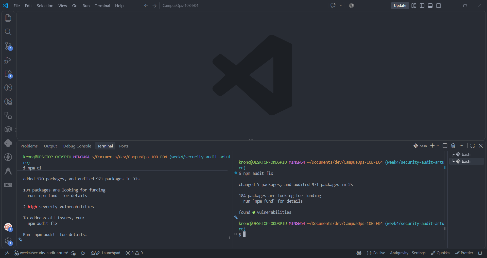
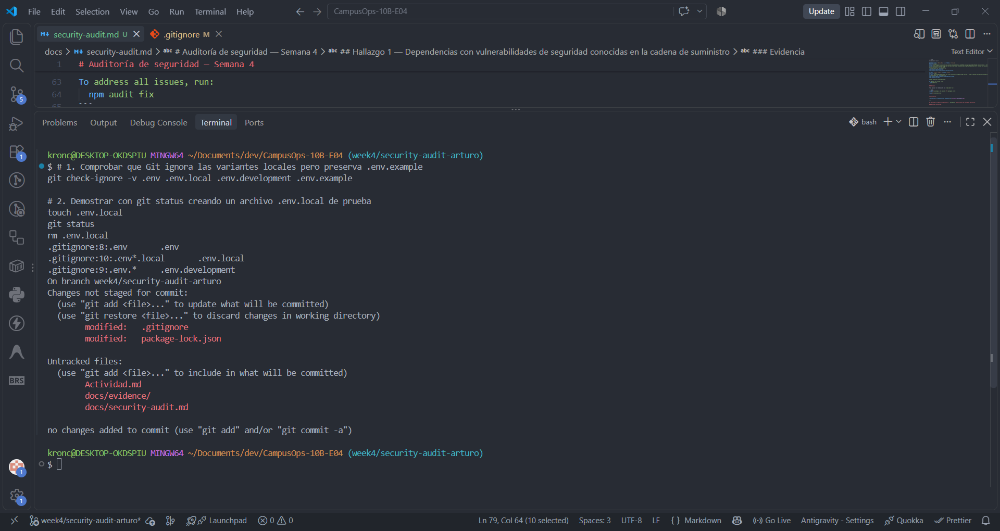
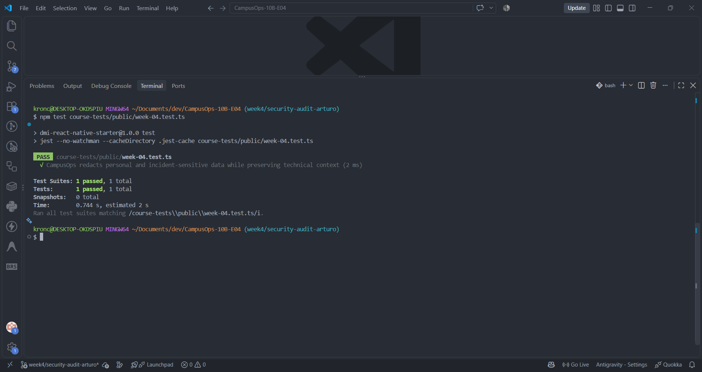

# Auditoría de seguridad — Semana 4

## Hallazgos

| # | Hallazgo | Riesgo | Solución aplicada | Evidencia |
|---|---|---|---|---|
| 1 | Dependencias vulnerables en la cadena de suministro (`npm audit`) | Riesgo de Denegación de Servicio (DoS / ReDoS) e inyección XML en componentes de parseo (`@xmldom/xmldom` y `js-yaml`) | Actualización de dependencias a versiones parcheadas mediante `npm audit fix` | `evidence/hallazgo-1.png` |
| 2 | Reglas incompletas en `.gitignore` para archivos de entorno (`.env*`) | Exposición accidental de credenciales y variables de entorno locales en el repositorio remoto | Se agregaron reglas para `.env.*`, `.env*.local` y excepción para `.env.example` | `evidence/hallazgo-2.png` |
| 3 | Ausencia de sanitización en telemetría y registros (`redactForTelemetry`) | Fuga de información sensible (tokens, correos, nombres, ubicaciones y notas internas) en logs técnicos | Implementación de `redactForTelemetry` que enmascara claves sensibles con `[REDACTED]` sin mutar la entrada | `evidence/hallazgo-3.png` |

---

## Hallazgo 1 — Dependencias con vulnerabilidades de seguridad conocidas en la cadena de suministro

### Problema encontrado

Al realizar un análisis de composición de software (SCA) sobre las dependencias del proyecto ejecutando `npm audit`, se detectaron vulnerabilidades de severidad alta en paquetes del árbol de dependencias:

1. **`@xmldom/xmldom` (<=0.8.14 y 0.9.0-beta.1 - 0.9.11)**:
   - Presenta fallos de validación como inyección de fragmentos XML (*XML fragment injection via invalid EntityReference.nodeName* - [GHSA-6gmq-8vp8-gcm6](https://github.com/advisories/GHSA-6gmq-8vp8-gcm6)).
   - Consumo cuadrático de tiempo y memoria (ReDoS / DoS) durante la recuperación y procesamiento de entradas malformadas ([GHSA-8344-3jmq-59r6](https://github.com/advisories/GHSA-8344-3jmq-59r6), [GHSA-965w-775f-mr7g](https://github.com/advisories/GHSA-965w-775f-mr7g)).

2. **`js-yaml` (3.0.0 - 3.15.1 y 4.0.0 - 4.3.1)**:
   - Presenta una vulnerabilidad donde `maxTotalMergeKeys` no limita adecuadamente el uso de CPU ante fuentes de unión vacías ([GHSA-2883-xcg3-v3hh](https://github.com/advisories/GHSA-2883-xcg3-v3hh)).

### Riesgo

El uso de componentes vulnerables o desactualizados (*OWASP Top 10: A06:2021 – Vulnerable and Outdated Components*) representa un riesgo directo para la disponibilidad e integridad de la aplicación:
- Un atacante que suministre datos XML o YAML diseñados maliciosamente puede provocar un bloqueo de la aplicación por consumo excesivo de CPU o memoria (Denegación de Servicio - DoS).
- Las vulnerabilidades en parsers XML pueden permitir inyecciones y alteraciones no deseadas en la estructura de datos procesados.

### Solución

Se realiza la remediación actualizando las versiones de los paquetes afectados a versiones seguras y parcheadas:
- Actualizar `@xmldom/xmldom` a las versiones corregidas (`0.8.15` / `0.9.12`).
- Actualizar `js-yaml` a las versiones corregidas (`3.15.2` / `4.3.2`).

Esta corrección se aplica mediante la ejecución de `npm audit fix`, asegurando que `npm audit` reporte 0 vulnerabilidades sin alterar la compatibilidad ni los contratos funcionales del proyecto.

### Antes

Salida del comando `npm audit`:

```bash
# npm audit report

@xmldom/xmldom  <=0.8.14 || 0.9.0-beta.1 - 0.9.11
Severity: high
xmldom: XML fragment injection via invalid EntityReference.nodeName during requireWellFormed serialization - https://github.com/advisories/GHSA-6gmq-8vp8-gcm6
xmldom: Quadratic-time parsing via the malformed-input recovery path — parseElementStartPart re-scan and normalize() adjacent-text merge - https://github.com/advisories/GHSA-93r5-fhx6-vmg9
fix available via `npm audit fix`
node_modules/@xmldom/xmldom
node_modules/plist/node_modules/@xmldom/xmldom

js-yaml  3.0.0 - 3.15.1 || 4.0.0 - 4.3.1
Severity: high
js-yaml: maxTotalMergeKeys does not limit CPU use for empty merge sources - https://github.com/advisories/GHSA-2883-xcg3-v3hh
fix available via `npm audit fix`
node_modules/@expo/xcpretty/node_modules/js-yaml
node_modules/js-yaml

2 high severity vulnerabilities

To address all issues, run:
  npm audit fix
```

### Después

Tras aplicar la remediación con `npm audit fix`:

```bash
changed 5 packages, and audited 971 packages in 3s

found 0 vulnerabilities
```

### Evidencia



---

## Hallazgo 2 — Reglas incompletas en `.gitignore` para archivos de variables de entorno

### Problema encontrado

El archivo `.gitignore` original únicamente contenía la regla literal `.env`. En proyectos desarrollados con Node.js y React Native / Expo, es común la utilización de archivos de entorno locales o por ambiente, tales como `.env.local`, `.env.development`, `.env.test` o `.env.production`.

Dado que `.gitignore` no cubría patrones comodín para estos archivos, Git los detectaba como archivos sin seguimiento (*untracked*), dejándolos expuestos a ser agregados accidentalmente al control de versiones mediante comandos globales como `git add .` o `git commit -a`.

### Riesgo

Si un desarrollador crea localmente un archivo como `.env.local` para almacenar credenciales de prueba, llaves de API o rutas privadas, este archivo podría ser subido inadvertidamente al repositorio público de GitHub. Una vez en el historial de Git, los secretos quedan comprometidos para cualquier persona con acceso al repositorio.

### Solución

Se ampliaron las reglas en [.gitignore](file:///c:/Users/kronc/Documents/dev/CampusOps-10B-E04/.gitignore) incorporando `.env.*` y `.env*.local`, a la vez que se añadió la excepción explícita `!.env.example` para asegurar que las plantillas de configuración sin secretos puedan seguir siendo versionadas:

```gitignore
.env
.env.*
.env*.local
!.env.example
```

### Antes

Configuración previa en `.gitignore`:

```gitignore
dist/
.env
*.jks
```

Comprobación con `git check-ignore -v .env.local`:
```bash
# No devolvía ninguna regla: el archivo no estaba ignorado y aparecía en git status
```

### Después

Configuración corregida en `.gitignore`:

```gitignore
dist/
.env
.env.*
.env*.local
!.env.example
*.jks
```

Comprobación con `git check-ignore -v .env .env.local .env.development .env.example`:
```bash
.gitignore:8:.env	.env
.gitignore:10:.env*.local	.env.local
.gitignore:9:.env.*	.env.development
```

El archivo `.env.example` permanece rastreado, mientras que `.env.local` y `.env.development` son ignorados correctamente por Git y no aparecen como archivos pendientes en `git status`.

### Evidencia



---

## Hallazgo 3 — Ausencia de sanitización de información sensible y personal en registros de telemetría

### Problema encontrado

En el flujo de telemetría y monitoreo de la aplicación (`src/course-evaluation/index.ts`), la función `redactForTelemetry` se encontraba sin implementar (arrojando la excepción `pending('redactForTelemetry')`).

Al procesar eventos técnicos, reportes de incidencias o métricas que capturan llamadas de red y datos de usuario, los objetos contenían información altamente sensible en claro:
- Cabeceras de autenticación con tokens Bearer (`authorization`, `token`).
- Datos de identificación personal (PII) de estudiantes, reportantes y personal técnico (`email`, `displayName`, `userId`, `assignedTechnicianId`).
- Datos confidenciales de las incidencias del campus (`location`, `latitude`, `longitude`, `photos`, `internalComments`).

Sin una función de sanitización activa, estos datos viajarían íntegros a herramientas de telemetría externa o consolas de depuración.

### Riesgo

La filtración de información privada en registros técnicos (*OWASP A09:2021 – Security Logging and Monitoring Failures*) compromete la confidencialidad de los usuarios y la seguridad de las instalaciones:
- Un atacante o tercero con acceso a los logs de telemetría podría extraer tokens de sesión activos para suplantar identidades.
- Se vulnera el principio de privacidad por diseño al exponer nombres reales, correos y notas operativas internas en sistemas de monitoreo técnico diseñados únicamente para métricas y depuración.

### Solución

Se implementó la función `redactForTelemetry` en `src/course-evaluation/index.ts`. La función normaliza las claves de los objetos (en minúsculas y sin guiones ni caracteres separadores) y sustituye los valores de todas las claves sensibles por el marcador seguro `'[REDACTED]'`, preservando únicamente el contexto técnico no sensible (`incidentId`, `status`, `attempt`, `durationMs`) y garantizando que el objeto de entrada no sea mutado.

### Antes

La ejecución de la prueba automatizada de sanitización (`course-tests/public/week-04.test.ts`) fallaba porque la función no estaba implementada:

```bash
FAIL course-tests/public/week-04.test.ts
  ● CampusOps redacts personal and incident-sensitive data while preserving technical context

    redactForTelemetry must be implemented in the assigned week

      11 | function pending(name: string): never {
    > 12 |   throw new Error(`${name} must be implemented in the assigned week`);
         |         ^
      13 | }

Test Suites: 1 failed, 1 total
Tests:       1 failed, 1 total
```

### Después

Tras implementar la sanitización recursiva en `redactForTelemetry`, la prueba se ejecuta con éxito:

```bash
PASS course-tests/public/week-04.test.ts
  √ CampusOps redacts personal and incident-sensitive data while preserving technical context (3 ms)

Test Suites: 1 passed, 1 total
Tests:       1 passed, 1 total
```

El objeto resultante enmascara todos los campos sensibles y mantiene intacto el contexto técnico:

```json
{
  "request": {
    "headers": {
      "authorization": "[REDACTED]",
      "accept": "application/json"
    }
  },
  "profile": {
    "email": "[REDACTED]",
    "displayName": "[REDACTED]"
  },
  "incidentId": "campus-inc-001",
  "location": "[REDACTED]",
  "photos": "[REDACTED]",
  "internalComments": "[REDACTED]"
}
```

### Evidencia


